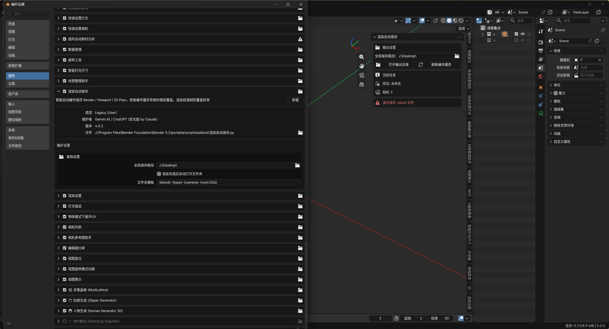

# 渲染自动保存 (Render Auto Save)

Blender 的渲染输出要自己配输出路径和文件名：忘了改就会把上一张成果覆盖掉；批量出多机位图得逐个手动改路径；想快速看效果没有顺手通道；出 ID 通道还要手动改视口着色、渲完再改回来。

本插件接管 3D 视图的 `F12`：**每次渲染自动按模板编号保存，双重防覆盖**，另带视口快速预览、ID Pass 和多相机批量渲染。

## 功能总览

| 功能 | 说明 |
| --- | --- |
| 正式渲染（F12） | 渲染并自动保存，文件名按模板自动编号 |
| 视口快速预览 | OpenGL 渲染当前视口并自动保存，出图验证构图 |
| ID Pass | 自动切到纯色平光视口渲染，渲完自动还原设置（选区/遮罩通道） |
| 批量渲染选中相机 | 选中多个相机一键逐个渲染，每个相机独立编号保存 |
| 双重防覆盖 | 渲染前同步扫描输出目录取最大编号，再逐个校验实际写出的文件路径 |
| 渲染完成自动打开输出文件夹 | 可在偏好设置关闭 |

**文件名模板**：默认 `{blend}-{type}-{camera}-{num:03d}`，支持 `{blend}` `{camera}` `{type}` `{date}` `{num:03d}` 字段；模板不含编号时会自动追加，避免同名覆盖。

**命名预览**：N 面板实时显示三种通道下一次渲染将使用的完整文件名，出图前心中有数。

## 快捷键与入口

- **`F12`**（3D 视图内）：正式渲染 + 自动保存（接管原生 F12，其他编辑器内不受影响）
- **N 面板**：3D 视图 → `N` → 渲染自动保存：输出路径、命名预览、状态、全部按钮

## 设置

偏好设置（编辑 → 偏好设置 → 扩展 → 渲染自动保存）或 N 面板：

- **全局保存路径**：所有工程通用的输出文件夹，支持 `//` 相对路径（默认 `//RenderOutput/`）
- **文件名模板**：见上
- **渲染完成后自动打开文件夹**：开关

## 安装

1. 在 [Releases](../../releases) 页面下载 `render_auto_save-x.x.x.zip`
2. Blender → 编辑 → 偏好设置 → 获取扩展（Get Extensions）
3. 点击右上角下拉箭头 → 从磁盘安装（Install from Disk），选择 zip 并启用

## 兼容性

- 需要 Blender 5.0 及以上

## 许可证

[GPL-3.0-or-later](LICENSE)
